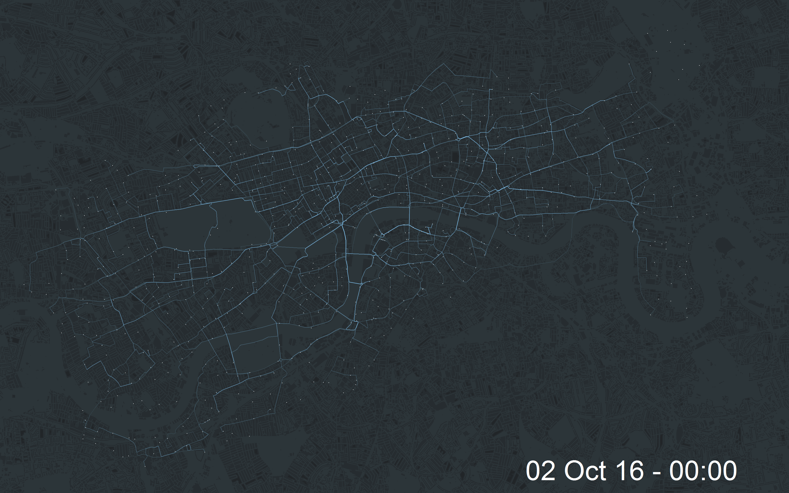

# Movement Visualisations

Exploring different ways of using Python and R to create visualisations from interesting datasets

##1. Cycling Data (One Day of TFL Rentals)

Bing Directions API is used to 'guess' a cycling route between origin-destination

##2. Flight Data (from opensky-network)

Scraping 24 hours worth of world-flights into an SQLite database. Minor GIS operations such as point-in-polygon to produce a visualisation which discerns inbound, outbound, and passing flights

##3. Tube Data (One Day of Oyster Journies)

A graph of the tube-network is created to estimate the shortest-path in the network

